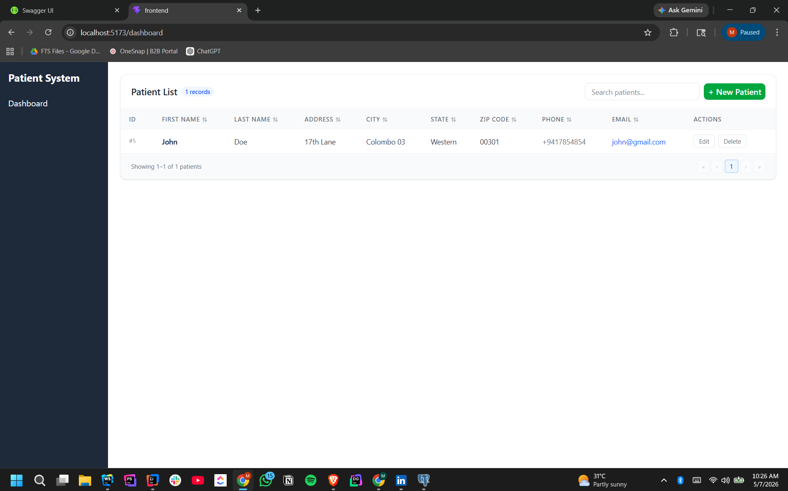
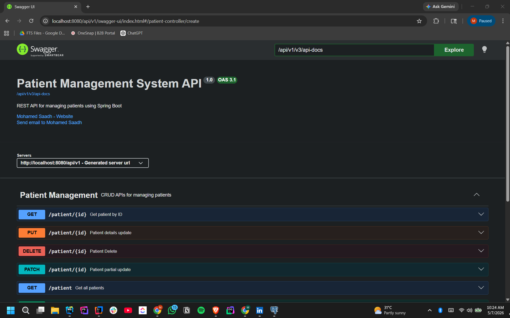

# Spring Boot + React Patient Management System

This project consists of two parts:
1. A **backend** REST application built using **Spring Boot** and **PostgreSQL** that handles patient data.
2. A **frontend** UI built using **React** that interacts with the backend to perform CRUD operations on patient data.

The backend exposes REST endpoints, and the frontend displays and interacts with the data in a table.

## Table of Contents

- [Backend Setup](#backend-setup)
- [Frontend Setup](#frontend-setup)
- [Running the Application](#running-the-application)
- [API Documentation](#api-documentation)

---

## Backend Setup

### Prerequisites

- **Java 17 or higher**: Ensure that you have Java 17 or a higher version installed on your system.
- **Maven**: This project uses Maven for dependency management. Make sure you have Maven installed.

### Configure PostgreSQL Database

1. **Install PostgreSQL** if you don't already have it. Follow the installation steps on the official [PostgreSQL website](https://www.postgresql.org/download/).

2. **Create the database**:
    - Open PostgreSQL command line or use any database management tool like pgAdmin and run the following SQL query to create a new database:

   ```sql
   CREATE DATABASE patientdb;
   ```

3. **Configure Database Connection**:
    - Open `src/main/resources/application.properties` and update the database connection details with your PostgreSQL configuration. Replace the following placeholders:

   ```properties
   spring.datasource.url=jdbc:postgresql://localhost:5432/patientdb
   spring.datasource.username=your_username
   spring.datasource.password=your_password
   spring.jpa.hibernate.ddl-auto=update
   spring.datasource.driver-class-name=org.postgresql.Driver
   spring.jpa.database-platform=org.hibernate.dialect.PostgreSQLDialect
   ```

   Make sure to update `your_username` and `your_password` with your actual PostgreSQL credentials.

### Running the Backend

1. **Build and Run the Spring Boot Application**:

   To run the backend server, navigate to the root of the project in your terminal and run:

   ```bash
   ./mvnw spring-boot:run
   ```

   This will start the backend application on port **8080**.

2. **Verify the Backend is Running**:

   Once the server is up and running, you can verify it by navigating to:

   ```
   http://localhost:8080
   ```

   You should see the Spring Boot application running.

---

## Frontend Setup

### Prerequisites

- **Node.js**: Ensure that you have Node.js installed. You can download it from [Node.js](https://nodejs.org/).
- **React**: This project uses React for the frontend.

### Running the Frontend

1. **Install Dependencies**:

   Navigate to the frontend directory and run:

   ```bash
   npm install
   ```

   This will install all the necessary dependencies for the React frontend.

2. **Create `.env` File**:

   In the frontend directory, create a `.env` file and add the following line to specify the backend URL:

   ```env
   VITE_BACKEND_URL=http://localhost:8080/api/v1
   ```

   This tells the frontend where to send requests for CRUD operations.

3. **Start the Frontend**:

   Run the following command to start the frontend development server:

   ```bash
   npm run dev
   ```

   The frontend will now be running on [http://localhost:5173](http://localhost:5173).

---

## Running the Application

### Backend

Once both parts are set up, start the backend server on port **8080** by running:

```bash
./mvnw spring-boot:run
```

This will start the Spring Boot application, which exposes the `/patient` endpoint to interact with the PostgreSQL database.

### Frontend

Start the React frontend by running:

```bash
npm run dev
```

This will start the frontend on [http://localhost:5173](http://localhost:5173), which will automatically interact with the backend on [http://localhost:8080](http://localhost:8080).



---

## API Documentation

You can access the OpenAPI documentation for the backend by navigating to:

```
http://localhost:8080/api/v1/swagger-ui/index.html
```

This will show you the API documentation, where you can explore and interact with the available endpoints:



| Method   | Endpoint           | Description               |
|----------|--------------------|---------------------------|
| `GET`    | `/patient`         | Get a list of all patients |
| `POST`   | `/patient`         | Create a new patient       |
| `PUT`    | `/patient/{id}`    | Update an existing patient |
| `PATCH`  | `/patient/{id}`    | Partially update a patient |
| `DELETE` | `/patient/{id}`    | Delete a patient           |

---

## Conclusion

You now have a fully functional Spring Boot backend connected to a PostgreSQL database and a React frontend that interacts with the backend to manage patient data.

Feel free to test the application by performing CRUD operations through the UI.